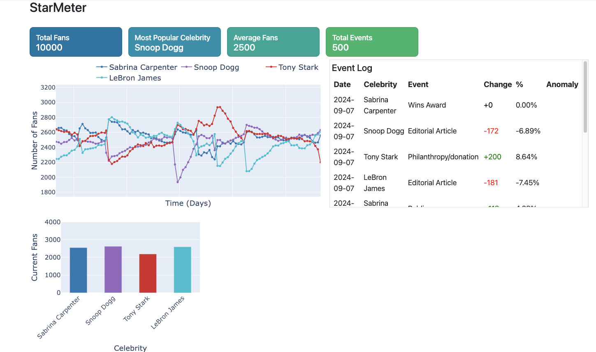
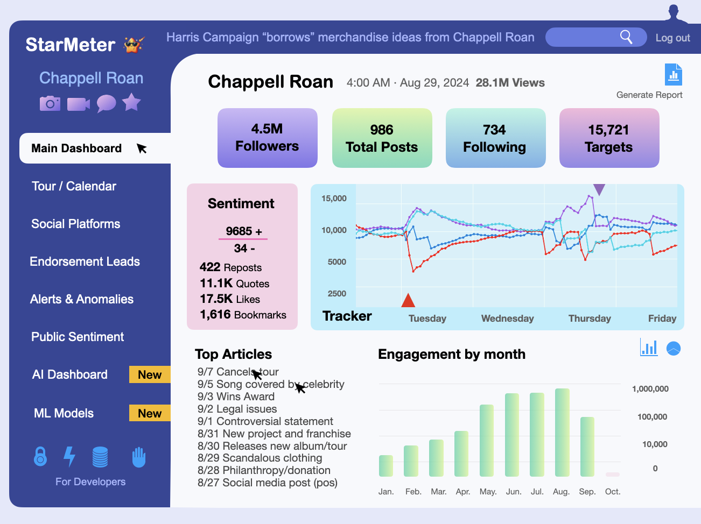
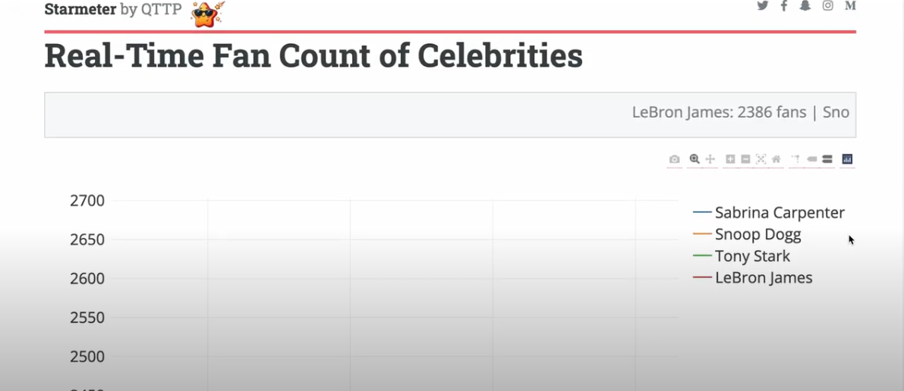
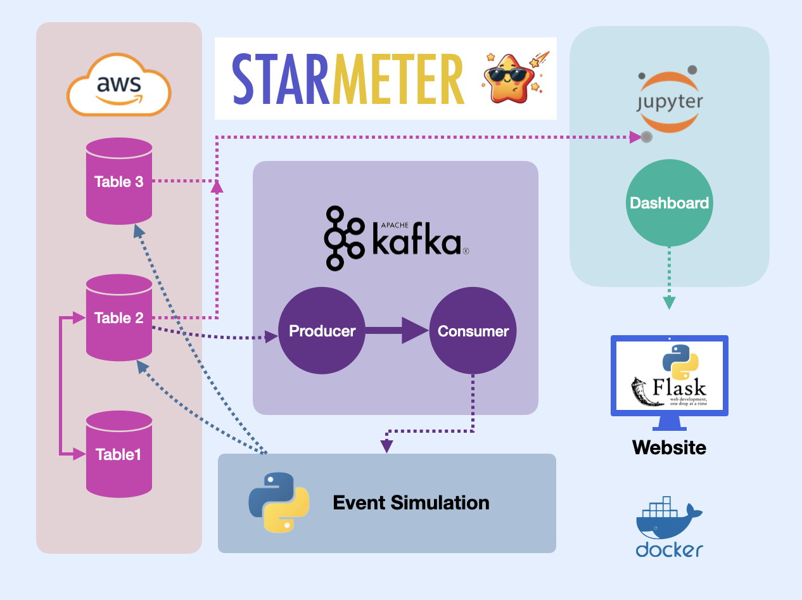

### Authors
- **Peter Van Beever:** [GitHub](https://github.com/PeterVanBeever)
- **Teddy Archibald:** [GitHub](https://github.com/teddyvere)
- **Qian Wang:** [GitHub](https://github.com/CITATS928)
- **Tim Linkous:** [GitHub](https://github.com/TimLinkous)

# Starmeter
Starmeter is a dynamic web application designed for agents, promoters, and managers to track and analyze the impact of various events on a celebrity's public image in real-time. By inputting data related to a celebrity's social media posts, news mentions, and public appearances, users can monitor how these events affect popularity metrics and public sentiment through an intuitive dashboard.

# Overview
Managing a celebrity's public image is crucial, and Starmeter provides real-time insights into events that influence public sentiment. Whether it's a new release, a public controversy, or a major appearance, Starmeter tracks these events and displays their impact through real-time visualizations.

With this information, you can:

Adjust publicity strategies based on real-time data.
Respond quickly to negative press or controversies.
Make informed decisions to boost a celebrity’s public image.
Monitor key performance indicators (KPIs) and event logs to understand the trajectory of a celebrity’s popularity.
Features
Real-Time Data Tracking: Continuously processes data related to celebrity events such as social media activity, news articles, and public appearances.
Sentiment Analysis: Analyzes public sentiment surrounding the celebrity, identifying positive or negative trends.
Interactive Dashboard: Visualizes KPIs and event logs, offering a comprehensive view of the celebrity's current standing.
Event Impact Analysis: Tracks how specific events affect the celebrity's popularity and sentiment over time.
Publicity Strategy Optimization: Provides real-time feedback, enabling you to adjust strategies to maintain or improve the celebrity's public image.
Minimum Viable Product (MVP)
Data Pipeline: Integrate and process data from various sources (social media, news, etc.) in real time.
Dashboard: Display key performance indicators and event logs with visualizations to track popularity trends.
Event Tracking: Monitor how different events impact public sentiment and popularity metrics.

Technologies Used
Python: The core programming language used for the application.
Flask: A lightweight web framework for building the Starmeter web application.
Flask-SocketIO: Enables real-time event updates to the dashboard.
SQLite: A lightweight database for storing processed data.
SQLAlchemy: ORM (Object-Relational Mapping) to interact with the SQLite database.
JavaScript & Plotly.js: For real-time, interactive data visualizations in the dashboard.
Jupyter Notebook: Used for prototyping and exploring data insights.

Getting Started
To get started with Starmeter, ensure you have the following installed:

Python 3.8+
MySQL
SQLAlchemy
Flask
Flask-SocketIO
Jupyter Notebook
Installation
Clone the repository and install the required dependencies:

bash
Copy code
git clone https://github.com/yourusername/starmeter.git
cd starmeter
pip install -r requirements.txt
Usage
Data Input: Input data related to celebrity events (social media posts, news articles, public appearances).
Real-Time Tracking: The Flask-SocketIO server processes and visualizes the input data in real-time.
Dashboard: Monitor the dashboard to see the impact of events on the celebrity’s public image and sentiment.
Decision-Making: Use the insights from the dashboard to make informed decisions about publicity strategies.
Running the Application
To run the Starmeter application, use the following command:

bash
Copy code
python main.py
This will start the Flask server, and you can view the dashboard in your browser by navigating to http://localhost:5000.

# Create Venv

python3 -m venv venv

source venv/bin/activate

# Install requirements

# Run Docker Container

To run the Flask app inside the Docker container, follow these steps:

# 1. Build the Docker Image
Ensure that you have Docker installed and running on your machine. Use the following command to build the Docker image for your Flask app:

docker build -t flask-app-python3.12 .
This command will use the Dockerfile to create the image and tag it as flask-app-python3.12.

# 2. Run the Docker Container
Once the image is built, you can run the Docker container with the following command:

docker run -p 5000:5000 flask-app-python3.12

# Install From Requirments.txt

pip3 install -r requirements.txt

# Demo
For a quick demo, check out our Google Slides presentation: Starmeter Presentation

# Contributing
We welcome contributions! Please read our CONTRIBUTING.md for more information on how to get involved.

# License
This project is licensed under the MIT License - see the LICENSE file for details.

# Contact
For any inquiries or feedback, please contact [Your Name] at [Your Email].